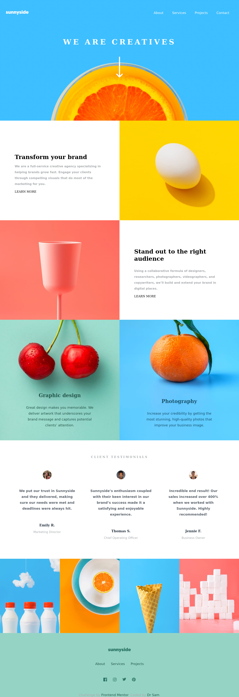

# Mobile-first solution using CSS Grid and Flexbox

This is a solution to the [Sunnyside agency landing page challenge on Frontend Mentor](https://www.frontendmentor.io/challenges/sunnyside-agency-landing-page-7yVs3B6ef). Frontend Mentor challenges help you improve your coding skills by building realistic projects.

## Table of contents

- [Overview](#overview)
  - [The challenge](#the-challenge)
  - [Screenshot](#screenshot)
  - [Links](#links)
- [My process](#my-process)
  - [Built with](#built-with)
  - [What I learned](#what-i-learned)
  - [Continued development](#continued-development)
  - [Useful resources](#useful-resources)
- [Author](#author)

## Overview

### The challenge

Users should be able to:

- View the optimal layout for the site depending on their device's screen size
- See hover states for all interactive elements on the page

### Screenshot

### Links

- Solution URL: [github repository](https://github.com/samankassou/sunnyside-agency-landing-page-main)
- Live Site URL: [Live site](https://samankassou.github.io/sunnyside-agency-landing-page-main/)

## My process

### Built with

- Semantic HTML5 markup
- CSS custom properties
- Flexbox
- CSS Grid
- Mobile-first workflow

### What I learned

CSS Grid position is the more important thing that I have learned in this challenge. I discovered how to load images base on the screen size and finally I know how to make some shapes in CSS like triangle, stars etc.

Change the color of a SVG loaded with `img` tag.

### Continued development

I will learn how to structure SASS files for big projects, explore BEM for best CSS class names.

### Useful resources

- [Color Picker online](https://www.imagecolorpicker.com) - This helped me for picking some colors inside the design images.
- [Codepen](https://www.codepen.io/sosuke/pen/Pjoqqp) - This codepen helped me for SVG colors inside `` tags.
- [The Shapes of CSS](https://www.css-tricks.com/the-shapes-of-css/) - Great articles to understand css shapes.
- [Load images based on screen size](https://www.questions/23414817/load-images-based-on-screen-size) - A Stackoverflow question which helped me to understand how to use the `<picture>` tag for loading many images based on the screen of the device.
- [W3Schools CSS Grid](https://www.w3schools.com/css/css_grid.asp) - This site helped me to understand CSS Grid.

## Author

- My Github - [Samankassou](https://www.github.com/samankassou)
- Frontend Mentor - [@samankassou](https://www.frontendmentor.io/profile/samankassou)
- Twitter - [@samankassou](https://www.twitter.com/samankassou3)
- My Blog - [@hashnode](https://drsam.hashnode.dev)
